# AnalogVoltMeterClock
An AnalogVoltMeterClock 🤷‍♂️

  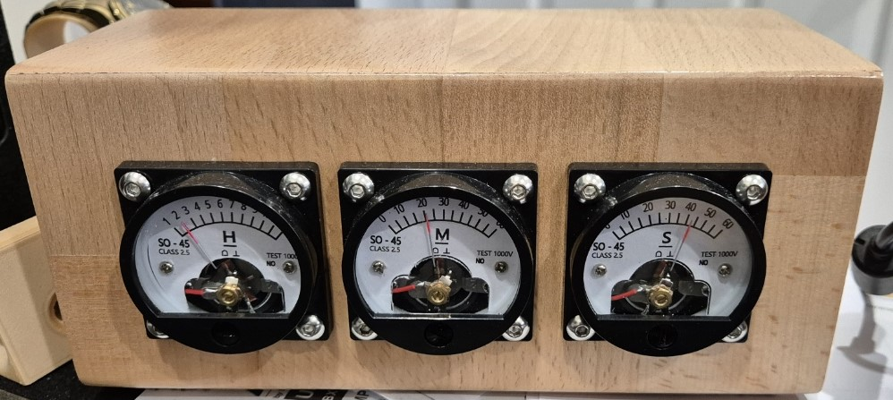

# What is this?
Just a fun project to show the time in another way

Inspiration from:

- https://hackaday.io/project/163977-esp8266-wifi-ntp-voltmeter-clock
- https://michaelteeuw.nl/post/what-time-is-it-fathers-day
- https://github.com/MichMich/AnalogVoltMeterClock

# I want one

Sure, youll need:

### BOM

- An Enclosure, it needs to be big enough to fit the analog dials as well as the PCB (100x60) <br>
  There is a printable one that MAY work here https://www.thingiverse.com/thing:3437800 BUT i am unsure if my PCB will fit this enclosure. Zip Files are committed in this git repo if you want to try it; OR build without the PCB and hard wire to the ESP module and use this one.
- Optional 3D printed back or solid back, (make room for your power connection!)
- 3x Analog Voltmeter SO-45 style gauges (voltage unimportant) <br>
  https://www.aliexpress.com/item/1005003489268646.html <br>
  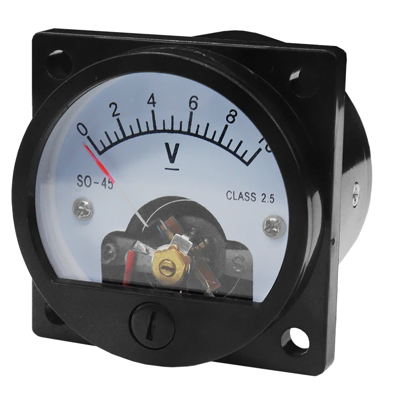
- 3x 3.9K Resistors OR any value between 2 - 5 K however you will need to work out your own calibration matrix
- PCB (gerber files are included [here](/AnalogVoltMeterClock/Gerber))
  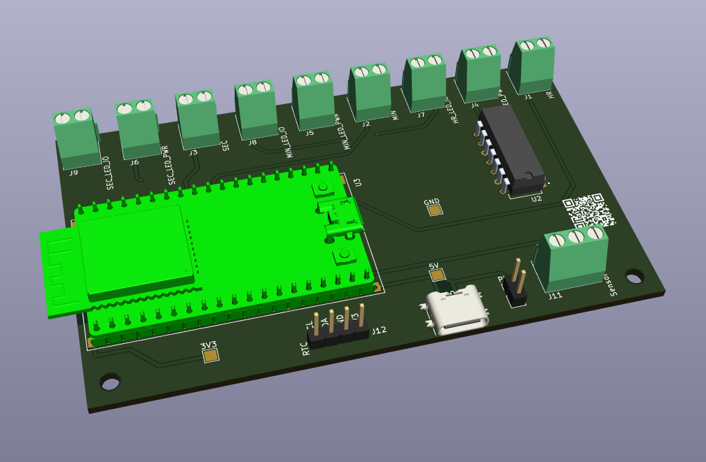
  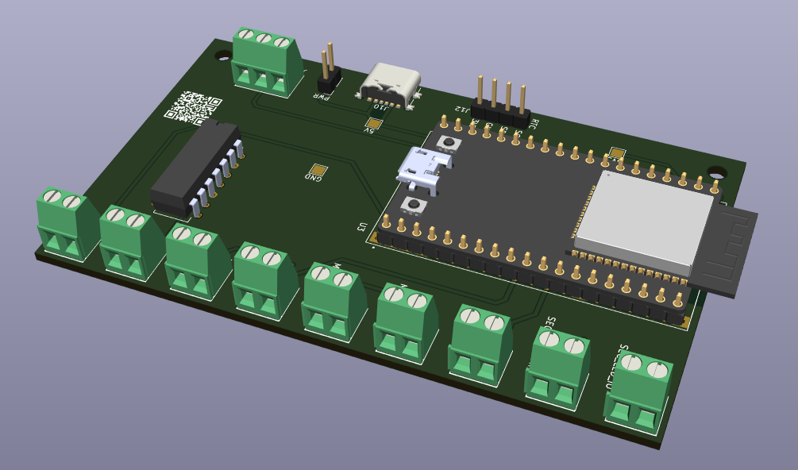
- "SW-420" Vibration Sensor <br>
  https://www.aliexpress.com/item/1005006205428052.html <br>
  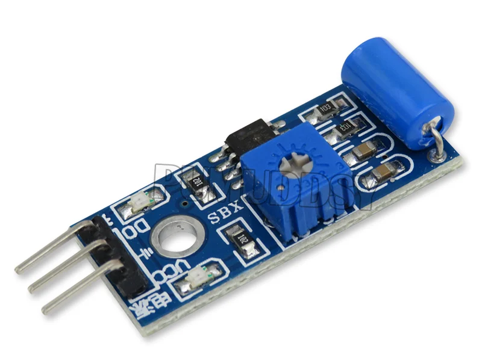
- "6 Pin" USB C Power socket OR panel mount DC socket and 5V power supply (use PWR header and omit USB) <br>
  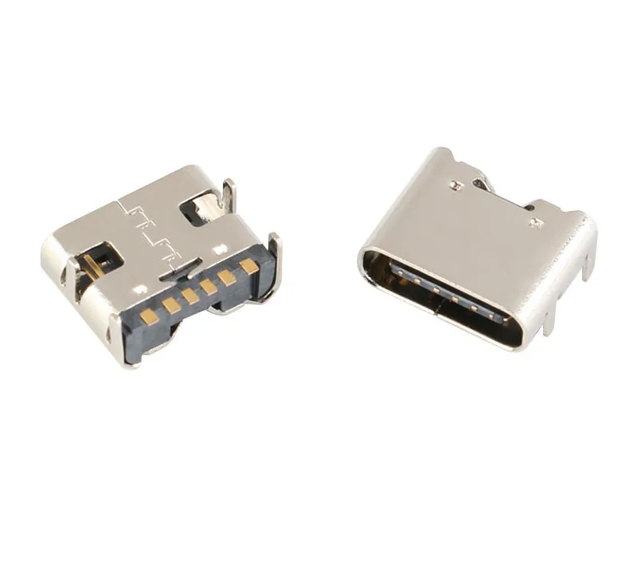 <br>
  https://www.aliexpress.com/item/32976798070.html
- 3.5mm Pitch 2P and 3P Screw Terminals <br>
   https://www.aliexpress.com/item/4000874208361.html <br>
   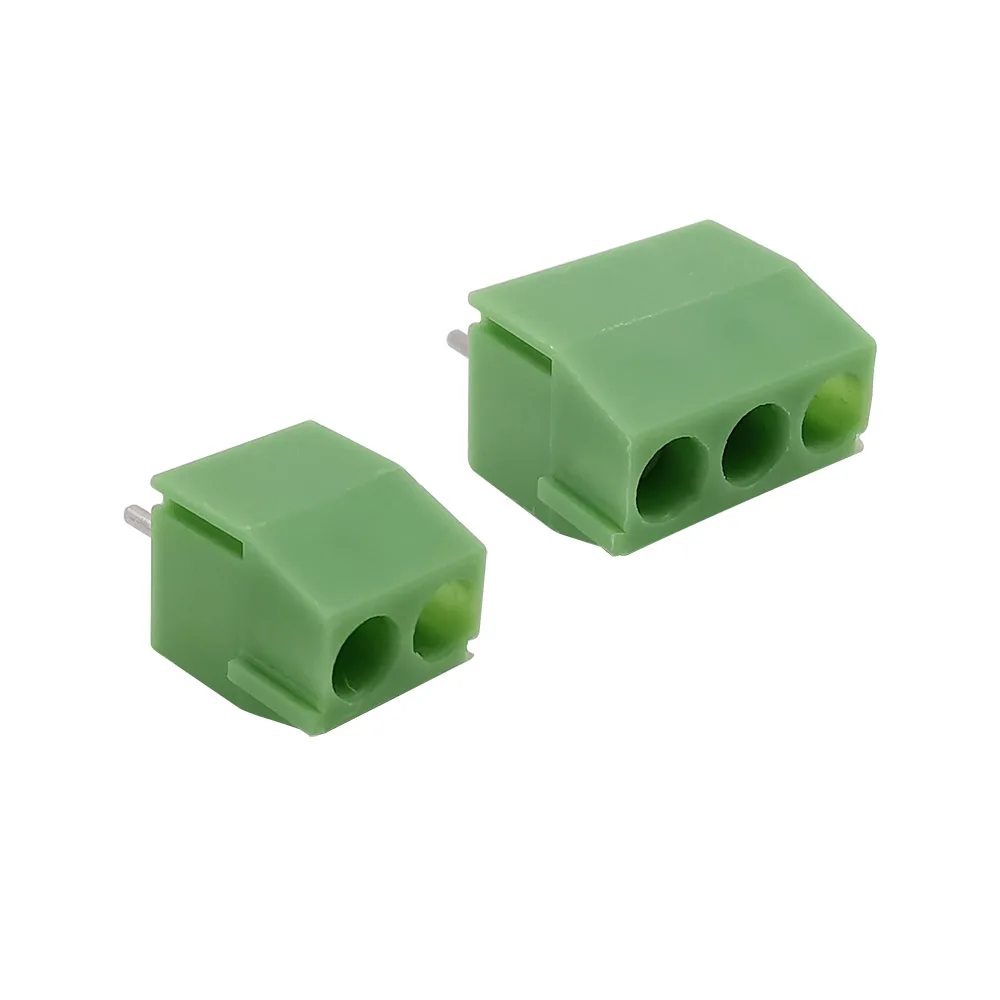 
- 1x FreeNove ESP32 WROOM 32E (not S3 variants) <br>
  https://store.freenove.com/products/fnk0090 or on Aliexpress<br>
  Note, Pinout of PCB is not compatible with other ESP modules like DevKit, etc <br>
 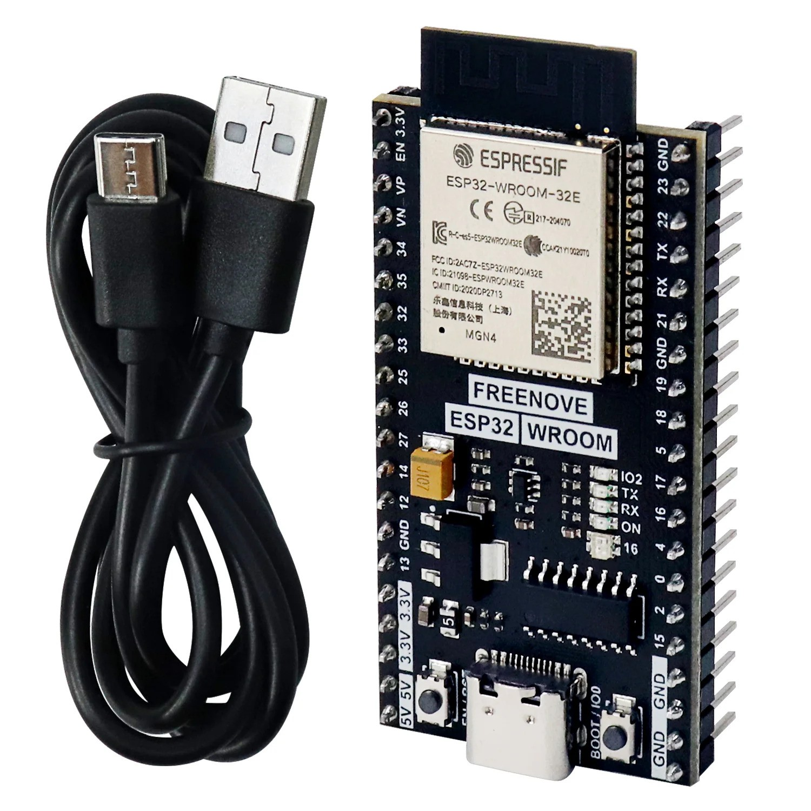
- SN74AHCT125N IC <br>
 https://www.digikey.com.au/en/products/detail/texas-instruments/SN74AHCT125N/375798
- suitable 14Pin DIP Socket (optional) e.g. <br>
 https://www.digikey.com.au/en/products/detail/cnc-tech/245-14-1-03/3441580 <br>
- 2.54 Headers and Sockets (optional) <br>
  Socket 2x 20 pin for ESP module <br>
  Header for Power (if desired) <br>
- SK6812 LED's (ON PCB!) (if other variants are used like WS2812B you will need to debug the light: code block slightly) <br>
  https://esphome.io/components/light/index.html <br>
  n.b the White Channel is not important, can be WW, CW or NW <br>
  https://www.aliexpress.com/item/32961777888.html <br>
  https://www.aliexpress.com/item/1005002509850925.html <br>
  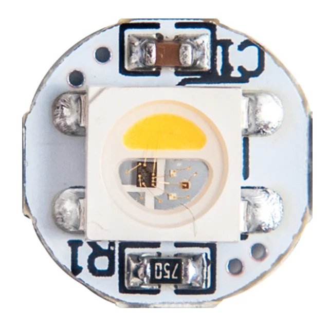 <br>
 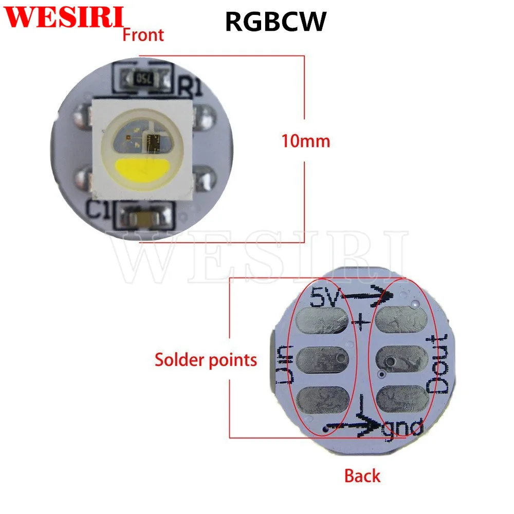 <br>
- Silicone Hookup Wire and Crimps
- ESPHome Dev environment to build and deploy the Image <br>
  https://esphome.io/guides/getting_started_command_line <br>
  https://esphome.io/guides/getting_started_hassio <br>
- Cut and Printed [stickers](/Gauges)) to replace voltmeter gauge; use the PDF or the svg can be edited and printed with Inkscape https://inkscape.org/ <br>


# How To!

- Obtain your BOM items
- Build your enclosure!
- Dissasemble your gauges, replace the existing resistors with the 3.9K resistors, wire and mount your LED's <br>
  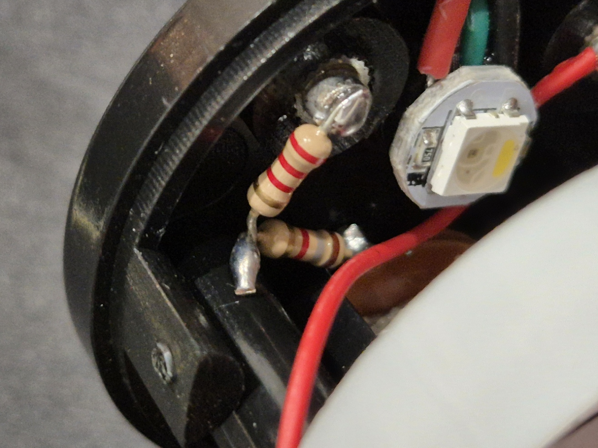 <br>
- Stick your gauge sticker over the original faceplace
- REASSEMBLE! <br>
   <br>
- Assemble your PCB
- Write the Base esphome image to your module https://web.esphome.io/ and connect to WIFI remember to also to include the `.h` files
- Edit the ESPHome Yaml file where required 
  - set MIN and MAX PWM
  - (optional) RGBW and Bright values
  - TimeZone (if not AEST) and or change to sntp see below
  - Disable Home Assistant api (remove encryption and key) if you dont use HA (also change time to sntp) <br>
    i.e:
    ```
    - platform: sntp
    #- platform: homeassistant
    timezone: Australia/Brisbane
    ```

- Build and Write the config to the module
- All should be working! 
- Connect to the Module Web Page and set LED colour
- Import into Home Assistant (optional)

# Calibration

[Excel sheets](/SpreadSheets) added to help calibrate! 

## PWM

- Use the Module web page to test values:
- Set Calibrate to ON <br>
 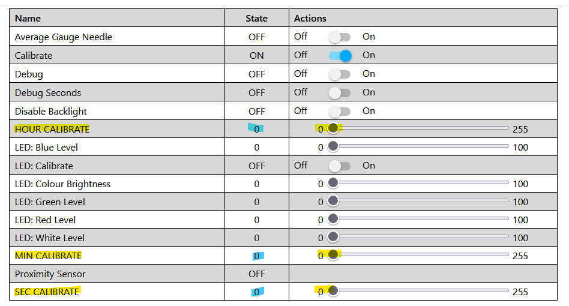 <br>
- Find your MIN and MAX needle values for Hour, Minute and Second using the HOUR CALIBRATE, MIN CALIBRATE and SEC CALIBRATE Sliders, take note of the blue number <br>
 <br>
- Min the needle should be set to the desired minimum value (for example minimum values): <br>
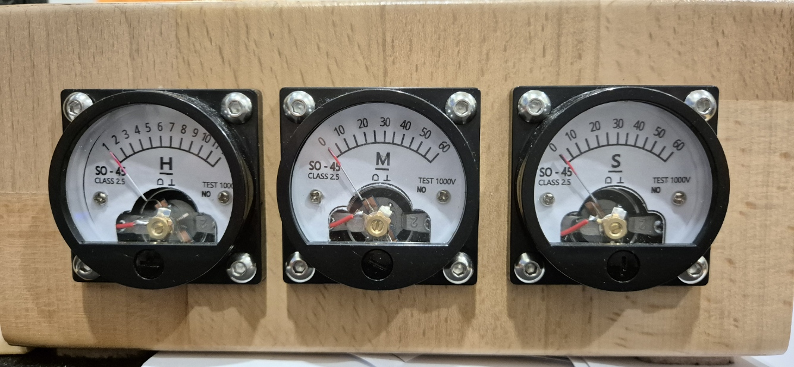 <br>
- Max is the same but the Maximum value (12 for Hour, and 60 for Min and Sec) <br>
- These numbers are recorded in the yaml file: <br>
  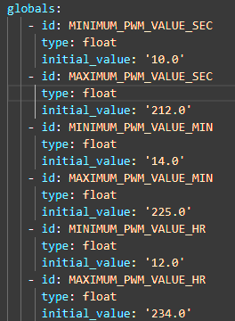 <br>
- This is the minimum amount of calibration required however you MUST set the "Average Gauge Needle" option to ON!

## Fine Tuned Calibration

- Continue to find each value and create a value MAP. <br>
- For example for Hour:
- find each PWM value for each number from 1 to 12
- Record the PWM values in `writeHandler.h` under `const int HOUR_NEEDLE[]` where each value represents the hour, the MAP works as such: <br>
  
  ```
  Midnight (12), 1 AM, 2, 3, 4, 5, 6, 7, 8, 9, 10, 11, 12, 1 PM, 2, 3, 4, 5, 6, 7, 8, 9, 10, 11
  ```

  DO NOT ALTER `const int HOUR_LOOKUP[]`

For Minute and Second there is a map for each second/minute, this can be performed by finding each PWM value per 5 interval (5 Seconds or 5 Minutes) THEN averaging the seconds and minutes in between. You are looking for as even as a spread between each minute/second represented as a whole integer 

  For example:

| Hour | PWM | Comment |
| :--: | :--: | :--: | 
| 0 | 14 | measured |
| 5 | 30 | measured |
| 10 | 48 | measured |

| Hour | PWM | Comment |
| :--: | :--: | :--: | 
| 0 | 14 | measured |
| 1 | 17 | averaged |
| 2 | 20 | averaged |
| 3 | 23 | averaged |
| 4 | 26 | averaged |
| 5 | 30 | measured |

Create a Map of all values and replace `const int SECOND_NEEDLE[]` and `const int MINUTE_NEEDLE[]`

You are able to fine tune the needle using the screw on the front of the dial

## LED

- enable LED: Calibrate
- To find your desired colour use 
  - LED: Blue Level
  - LED: Colour Brightness
  - LED: Green Level
  - LED: Red Level
  - LED: White Level

This value will save into eeprom but will not be retained if the module is reflashed, you can code these into the globals but!

## U2 Jumpers

The SN74AHCT125N can be a little .... sensitive and as we are only using one input and output a circuit has been built in where by if you accidently blow input/output 1A/1Y you can reconfgure the jumpers to use the other inputs and outputs! This avoids you throwing away an IC because one IO has failed. Hopefully.

 <br>

This table should help explain what jumpers you need to bridge. Note you will need to CUT the DEFAULT jumpers on JP3 and JP4 if you wish to use IO's 3 or 4, and cut the DEFAULT jumper on JP1 and JP5 to use IO 2

 <br>

More info can be found in the datasheet in the [repo](/sn74ahct125.pdf)

## To Do!

- Integrate a PCF8563 RTC module option for time keeping offline https://www.aliexpress.com/item/1005006438572175.html
- Code Improvements and tidy up
- ~~Excel sheet for calibration~~
- ~~Document matrix for IC~~
- 3D rear cover (STARTED!)
- Actual Assembly (still waiting on parts!)
- gif of movement

## I Wanna Contribute!

Sure, fork the repo and do ya thing then request a PR to merge!

## I found a bug or an Improvement!

As above OR open an Issue and lets see if we can fix
